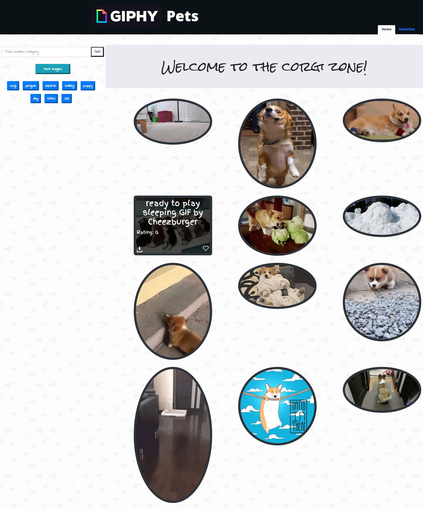

# Giphy Pets Library

Explore the plentiful and varied content from Giphy! Favorite interesting gifs and download your favorites!

## Getting Started

Open up the [project link](https://robertshaw87.github.io/Giphy-Library/) and you should be able to see the example webpage shown below:

Click one of the predefined buttons or add one of your own to display a selection of Gifs. Click one to begin the animation! Hover over each image to see more information about them. You can also find the download link in the bottom left hand corner of each image, and a toggleable favorites button on the bottom right. Your favorites will be stored across sessions, so take the time and build up your very own library of your favorite gifs!

### Prerequisites

You need to have a modern browser able to handle html5, javascript, and css. 

### Installing

No installation needed! Just open the page in your preferred browser.

## Built With

* Html

* CSS

* [Javascript](https://www.javascript.com/) - The scripting language used

* [BootstrapCDN v4.1.0](https://getbootstrap.com/docs/4.1/getting-started/introduction/) - The web framework used

* [jQuery v3.3.1](http://jquery.com/) - Java library for DOM and CSS manipulation

* [Google Fonts](https://fonts.google.com/) - Font repository

* [Giphy API](https://developers.giphy.com/) - Animated and still images

* [OMDB API](http://www.omdbapi.com/) - Movie suggestions

## Challenges

I wasn't able to completely nail down the styling of this app. I ended up focusing very hard on adding additional functionality such as a favorites section that persisted across visits, a one touch download button, and maintaining browsing continuity when switching between Home and Favorites. If only the gifs were the same aspect ratio, everything would look so much nicer! I did end up making a cool animation with the round border growing into the rectangular one though, so definitely still a gain in terms of more practice with styling.

## Authors

* **Robert Shaw** - *Initial work* - [robertshaw87](https://github.com/robertshaw87)
